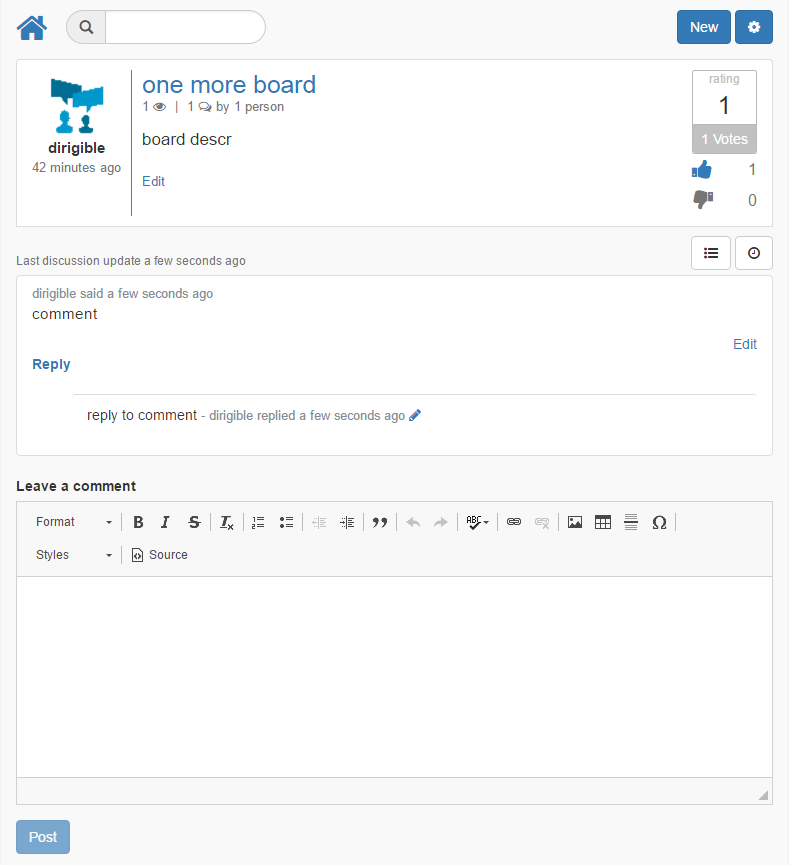

# template_web_discussions

Based on [Discussion Boards](https://github.com/dirigiblelabs/discussion_boards)

Desinged as one-page app.

Can list discussion boards:

Users can jump to details for activities such as review, vote, comment:

They can also swith to view the user discussion as a timeline

The project.json in the application generated by this template (once shared in git) will require the followng dependencies:

<pre>
"dependencies": [
        {
            "guid":"arestme",
            "type": "git",
            "url": "https://github.com/dirigiblelabs/arestme.git",
            "branch":"master"
    	}, {
    	    "guid":"core_users",
	        "type":"git",
	        "url":"https://github.com/dirigiblelabs/core_users.git",
	        "branch":"master"
    	}, {
    	    "guid":"tags",
	        "type":"git",
	        "url":"https://github.com/dirigiblelabs/tags.git",
	        "branch":"master"
    	}
	]
</pre>
